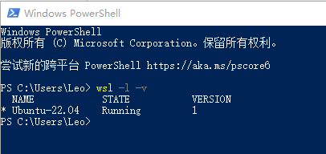
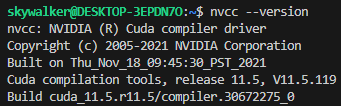

# **在Windows上优雅地使用LAMMPS**
尽管LAMMPS官方给出了Windows的安装包，但其在Windows平台上运算效率非常低，因此，Linux是运行LAMMPS最推荐的系统。

利用虚拟机运行Linux是一种解决办法，但是虚拟机带来的效率损失较高，难以充分利用硬件的性能；给电脑装上双系统则注定了这两个平台是完全独立的，每次切换系统需要重启整个电脑，非常繁琐。
那么有没有一种解决方案，既能同时运行Windows和Linux系统，又能够充分且灵活地调用硬件性能，两者之间的文件可以直接进行读写呢？答案是Windows Subsystem for Linux（WSL），即Linux的Windows子系统。

本教程包含以下内容：

1. 在Windows上安装WSL/WSL2；
1. 在WSL上配置LAMMPS；
1. 利用GPU加速LAMMPS。

如果你是在Ubuntu实体机上安装LAMMPS,可以直接[跳转到第二章](#lammps的安装)
CUDA加速可直接[跳转第三章](#lammps的cuda加速)
## **在Windows上安装WSL/WSL 2**
WSL需要Win 10 版本2004或更高（内部版本 19041 及更高版本）
### **启用WSL功能**
在Windows搜索栏中搜索控制面板：

程序→启用或关闭Windows功能→勾选适用于Linux的Windows子系统

稍作等待后，准备重启电脑。

### **安装WSL**
在微软应用商店中搜索Ubuntu，选择需要安装的发行版本（以Ubuntu 22.04.2为例）

下载完成后即可在开始菜单中找到，点击运行，开始安装。

随后根据提示设置用户名和密码。

至此我们已经完成了WSL的安装，在PowerShell（在Win搜索栏中搜索打开）中输入`wsl -l -v` 即可查看WSL的运行状态和版本。

### **WSL 2**
>“WSL 2 是对基础体系结构的一次重大改造，它使用虚拟化技术和 Linux 内核来实现其新功能。 此更新的主要目标是提高文件系统性能和添加完全的系统调用兼容性。”

WSL 2需要启用虚拟化功能（需要在BIOS中开启，可以在任务管理器中查看）

此外在还需要在控制面板的Windows功能里启用Hyper-V和虚拟机平台

稍作片刻后，重启电脑

此外还要下载[WSL 2 Linux 内核](https://wslstorestorage.blob.core.windows.net/wslblob/wsl_update_x64.msi)

双击运行开始安装更新

再次打开PowerShell，输入命令，`wsl –set-version`更改指定Linux分发版的版本，

其语法为：

`wsl --set-version <分发版名称> <版本号>`

以本教程使用的Ubuntu 22.04为例，命令为：

`wsl –set-version Ubuntu-22.04 2`

将前述安装的WSL转化为WSL2

出现操作成功完成表示转换完成，此时输入命令`wsl -l -v`即可看到Ubuntu-22.04运行在

WSL 2上。
### **优雅地使用WSL（将WSL链接至VS Code）**
>“VS Code是最好用的文本编辑器”

如果是第一次使用VS Code 建议在安装的时候勾选上这两个

在拓展中搜索WSL，安装即可

安装完成后，我们可以在点击左下角打开远程窗口，选择连接到WSL

稍作片刻连接成功后，通过Ctrl+”~”打开终端。

## **LAMMPS的安装**
至此，我们已经完成了Linux子系统的安装，接下来就是在子系统中安装LAMMPS。

### **安装依赖**
    sudo apt install build-essential #报404错误就换源，具体操作自行必应搜索

    apt install cmake

    apt install gfortran    

    apt update

    apt upgrade

安装并行LAMMPS所需的并行框架MPICH

从MPICH 官网下载最新稳定版的压缩包

    wget https://www.mpich.org/static/downloads/4.1.2/mpich-4.1.2.tar.gz

解压

    tar -xzvf mpich-4.1.2.tar.gz #文件名输前几个字母按Tab可以自动补全

进入文件mpi的文件目录

    cd mpich-4.1.2/

运行配置文件、安装：

    ./configure

    make -j4 #数字表示编译时利用的CPU核心数量，单独-j没有数字则是无限制，对CPU散热要求较高，负载过高会死机，也可能会编译报错，慎重使用

    make install

### **安装LAMMPS**
下载LAMMPS最新稳定版的源码压缩包

    wget <https://download.lammps.org/tars/lammps-stable.tar.gz>

解压

    tar -xzvf lammps-stable.tar.gz

进入解压出来的文件夹源码目录

    cd lammps-2Aug2023/ #不同版本的发布时间不同，当前最新稳定版为2023年8月2日发布的版本

    mkdir build 

    cd build

利用 cmake 编译

    cmake -C ../cmake/presets/basic.cmake ../cmake

LAMMPS中有很多可选择的包（Optional packages），分别可实现不同的功能，根据需求选择。在presets/中也给出了许多预设方案，其中basic包括了 MANYBODY、KSPACE、MOLECULE和RIGID

如果想利用OpenMP加速，则可以将上述命令写为

    cmake -C ../cmake/presets/basic.cmake -D PKG_OPENMP=yes ../cmake

没有问题的话，可以看到basic中的4个包和OPENMP都被启用

    make -j

    make install

完成

此时在build文件夹下可以找到编译结果lmp

### **配置环境变量**
回到WSL根目录下，

用vim编辑环境变量（第一次用自行搜索vim速成）

    vim .bashrc

在最后加上

    # LAMMPS

    export PATH=/home/skywalker/lammps-2Aug2023/build:$PATH

注意`/home/skywalker/`这部分是你的安装目录

保存退出

    source .bashrc

以上LAMMPS的基础部分已安装完成，可以在examples文件夹中进行测试。

## **LAMMPS的CUDA加速**
### **安装CUDA**
[CUDA官方安装指引](https://developer.nvidia.com/cuda-downloads?target_os=Linux&target_arch=x86_64&Distribution=WSL-Ubuntu&target_version=2.0&target_type=deb_network)

NV官网给出了WSL 2的CUDA安装方式，根据网页下方的安装指引即可

安装完成后，可以在终端中输入`nvidia-smi`可以看到如下的显卡信息

### **安装CUDA-toolkit**
    sudo apt-get -y install nvidia-cuda-toolkit

安装完成后，在终端输入 `nvcc --version`

看到如上信息表示安装完成，可以看到我们没有指定版本号，默认安装的toolkit是11.5

接着在.bashrc中写入

    export PATH=$PATH:/usr/local/cuda-12.2/bin  

    export LD_LIBRARY_PATH=$LD_LIBRARY_PATH:/usr/local/cuda-12.2/lib64

### **重新编译CUDA加速的LAMMPS**
回到lammps根文件夹

进入之前的build目录

    cd build/

cmake选择编译参数

    cmake -C ../cmake/presets/basic.cmake -D PKG_OPENMP=yes -D PKG_GPU=on -D GPU_API=cuda -D GPU_ARCH=sm75 ../cmake

可以看到相比之前增加了一大串，如果你是N卡，那么只需要根据你的显卡架构型号修改GPU\_ARCH的参数，具体如下：

    sm_30 for Kepler (supported since CUDA 5 and until CUDA 10.x)
    sm_35 or sm_37 for Kepler (supported since CUDA 5 and until CUDA 11.x)
    sm_50 or sm_52 for Maxwell (supported since CUDA 6)
    sm_60 or sm_61 for Pascal (supported since CUDA 8)
    sm_70 for Volta (supported since CUDA 9)
    sm_75 for Turing (supported since CUDA 10)
    sm_80 or sm_86 for Ampere (supported since CUDA 11, sm_86 since CUDA 11.1)
    sm_89 for Lovelace (supported since CUDA 11.8)
    sm_90 for Hopper (supported since CUDA 12.0)

GPU架构型号不清楚根据型号自行搜索（主流的10系卡是Pascal，20系是Turing，30系是Ampere，40系是Lovelace）

如果你是A卡的话，建议你换成N卡。

配置完成后在Enabled packages中确定GPU以及其他package已开启

    make -j

    make

完工！

本人电脑是5700X+2070，简单做一个10万个粒子LJ势的NPT模拟，耗时如下

|配置|速度（ns/day）|
| :-: | :-: |
|8 MPI|4\.375|
|8 MPI \* 2 OpenMP|8\.590|
|6 MPI \* 1 GPU|6\.687|
|8 MPI \* 1 GPU|6\.929|
|6 MPI \* 2 OpenMP \* 1 GPU|6\.639|
|8 MPI \* 2 OpenMP \* 1 GPU|6\.639|

还是OpenMP香（

应该是高U低显,显卡瓶颈了，毕竟是22年的CPU，18年的GPU（但实际上Zen3是20年发布了）
